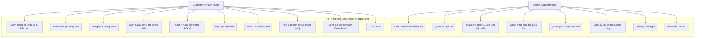

# Sơ đồ Use Case (Use Case Diagram)

```mermaid
graph TD
    subgraph System["Hệ Thống Đặt Lịch BarberShopBooking"]
        UC1("Xem thông tin Dịch vụ & Kiểu tóc")
        UC2("Xem Đánh giá công khai")
        UC3("Đăng ký & Đăng nhập")
        UC4("Xem & Cập nhật Hồ sơ cá nhân")
        UC5("Xem Khung giờ trống (AJAX)")
        UC6("Đặt Lịch Hẹn mới")
        UC7("Xem Lịch sử Đặt lịch")
        UC8("Hủy Lịch hẹn (>=2h trước lịch)")
        UC9("Đánh giá Barber (Lịch Completed)")
        UC10("Gửi Liên hệ")
        
        UC11("Xem Dashboard Thống kê")
        UC12("Quản lý Dịch vụ")
        UC13("Quản lý Barber & Lịch làm việc tuần")
        UC14("Quản lý Bộ sưu tập Kiểu tóc")
        UC15("Quản lý & Duyệt Lịch hẹn")
        UC16("Quản lý Tài khoản Người dùng")
        UC17("Quản lý Đánh giá")
        UC18("Phản hồi Liên hệ")
    end

    Customer["Customer (Khách hàng)"] --> UC1
    Customer --> UC2
    Customer --> UC3
    Customer --> UC4
    Customer --> UC5
    Customer --> UC6
    Customer --> UC7
    Customer --> UC8
    Customer --> UC9
    Customer --> UC10

    Admin["Admin (Quản trị viên)"] --> UC11
    Admin --> UC12
    Admin --> UC13
    Admin --> UC14
    Admin --> UC15
    Admin --> UC16
    Admin --> UC17
    Admin --> UC18
```
