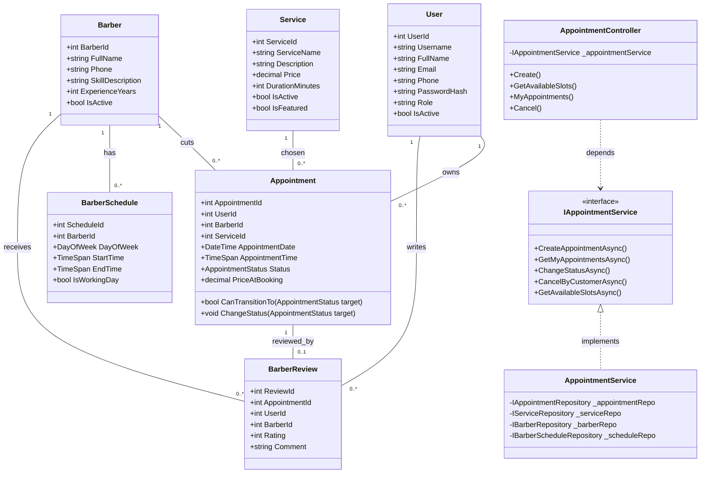

# Sơ đồ Lớp (Class Diagram)

```mermaid
classDiagram
    class User {
        +int UserId
        +string Username
        +string FullName
        +string Email
        +string Phone
        +string PasswordHash
        +string Role
        +bool IsActive
    }

    class Barber {
        +int BarberId
        +string FullName
        +string Phone
        +string SkillDescription
        +int ExperienceYears
        +bool IsActive
    }

    class Service {
        +int ServiceId
        +string ServiceName
        +string Description
        +decimal Price
        +int DurationMinutes
        +bool IsActive
        +bool IsFeatured
    }

    class BarberSchedule {
        +int ScheduleId
        +int BarberId
        +DayOfWeek DayOfWeek
        +TimeSpan StartTime
        +TimeSpan EndTime
        +bool IsWorkingDay
    }

    class Appointment {
        +int AppointmentId
        +int UserId
        +int BarberId
        +int ServiceId
        +DateTime AppointmentDate
        +TimeSpan AppointmentTime
        +AppointmentStatus Status
        +decimal PriceAtBooking
        +bool CanTransitionTo(AppointmentStatus target)
        +void ChangeStatus(AppointmentStatus target)
    }

    class BarberReview {
        +int ReviewId
        +int AppointmentId
        +int UserId
        +int BarberId
        +int Rating
        +string Comment
    }

    class IAppointmentService {
        <<interface>>
        +CreateAppointmentAsync()
        +GetMyAppointmentsAsync()
        +ChangeStatusAsync()
        +CancelByCustomerAsync()
        +GetAvailableSlotsAsync()
    }

    class AppointmentService {
        -IAppointmentRepository _appointmentRepo
        -IServiceRepository _serviceRepo
        -IBarberRepository _barberRepo
        -IBarberScheduleRepository _scheduleRepo
    }

    class AppointmentController {
        -IAppointmentService _appointmentService
        +Create()
        +GetAvailableSlots()
        +MyAppointments()
        +Cancel()
    }

    User "1" -- "0..*" Appointment : owns
    Barber "1" -- "0..*" Appointment : cuts
    Service "1" -- "0..*" Appointment : chosen
    Barber "1" -- "0..*" BarberSchedule : has
    Appointment "1" -- "0..1" BarberReview : reviewed_by
    User "1" -- "0..*" BarberReview : writes
    Barber "1" -- "0..*" BarberReview : receives

    IAppointmentService <|.. AppointmentService : implements
    AppointmentController ..> IAppointmentService : depends
```
