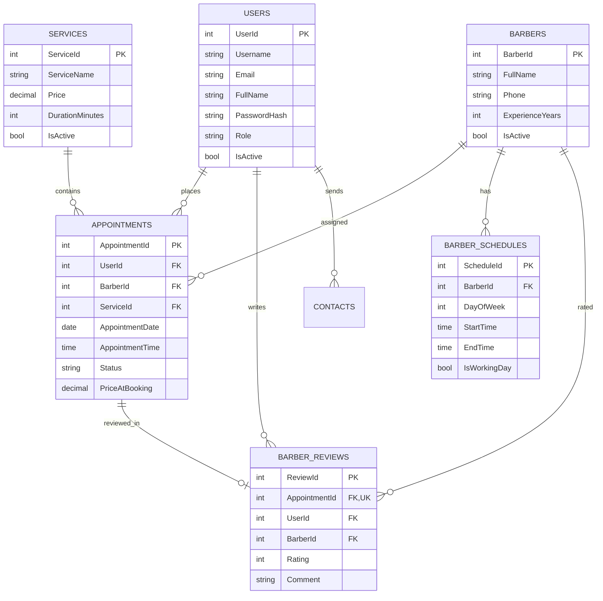

# Sơ đồ Entity Relationship (ERD)

```mermaid
erDiagram
    USERS ||--o{ APPOINTMENTS : "places"
    BARBERS ||--o{ APPOINTMENTS : "assigned"
    SERVICES ||--o{ APPOINTMENTS : "contains"
    BARBERS ||--o{ BARBER_SCHEDULES : "has"
    APPOINTMENTS ||--o| BARBER_REVIEWS : "reviewed_in"
    USERS ||--o{ BARBER_REVIEWS : "writes"
    BARBERS ||--o{ BARBER_REVIEWS : "rated"
    USERS ||--o{ CONTACTS : "sends"

    USERS {
        int UserId PK
        string Username
        string Email
        string FullName
        string PasswordHash
        string Role
        bool IsActive
    }

    BARBERS {
        int BarberId PK
        string FullName
        string Phone
        int ExperienceYears
        bool IsActive
    }

    SERVICES {
        int ServiceId PK
        string ServiceName
        decimal Price
        int DurationMinutes
        bool IsActive
    }

    BARBER_SCHEDULES {
        int ScheduleId PK
        int BarberId FK
        int DayOfWeek
        time StartTime
        time EndTime
        bool IsWorkingDay
    }

    APPOINTMENTS {
        int AppointmentId PK
        int UserId FK
        int BarberId FK
        int ServiceId FK
        date AppointmentDate
        time AppointmentTime
        string Status
        decimal PriceAtBooking
    }

    BARBER_REVIEWS {
        int ReviewId PK
        int AppointmentId FK,UK
        int UserId FK
        int BarberId FK
        int Rating
        string Comment
    }
```
