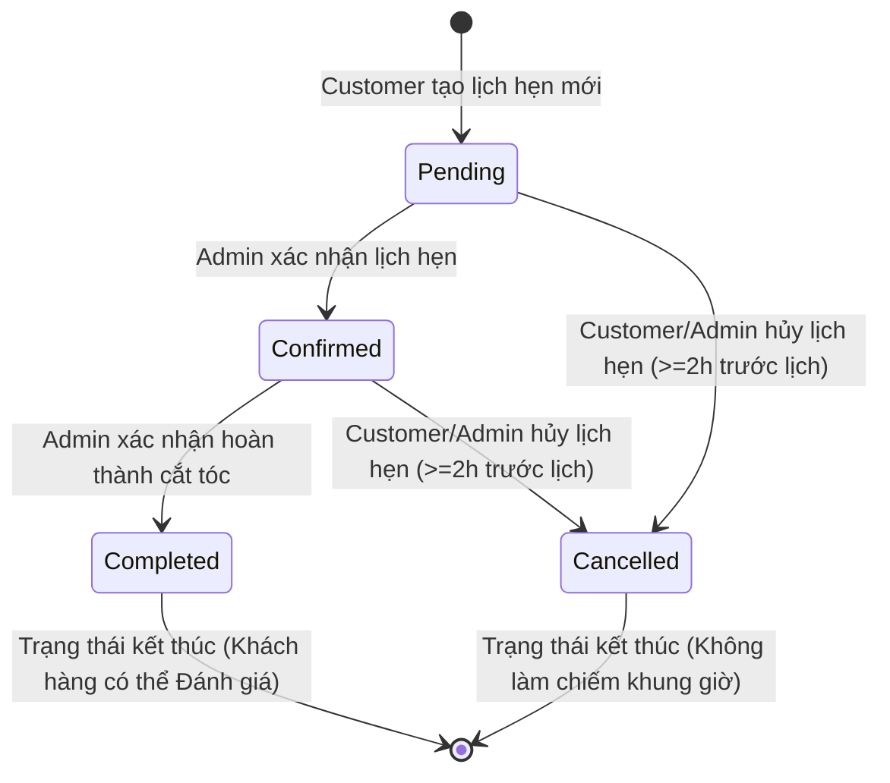

# Sơ đồ Trạng thái Lịch hẹn (Appointment State Diagram)

```mermaid
stateDiagram-v2
    [*] --> Pending : Customer tạo lịch hẹn mới

    Pending --> Confirmed : Admin xác nhận lịch hẹn
    Pending --> Cancelled : Customer/Admin hủy lịch hẹn (>=2h trước lịch)

    Confirmed --> Completed : Admin xác nhận hoàn thành cắt tóc
    Confirmed --> Cancelled : Customer/Admin hủy lịch hẹn (>=2h trước lịch)

    Completed --> [*] : Trạng thái kết thúc (Khách hàng có thể Đánh giá)
    Cancelled --> [*] : Trạng thái kết thúc (Không làm chiếm khung giờ)
```
