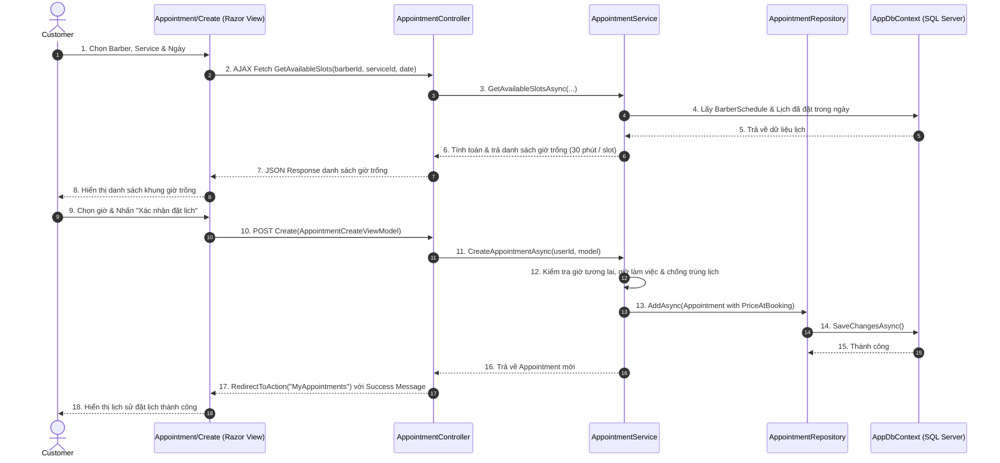

# Sơ đồ Tuần tự: Đặt Lịch Hẹn (Booking Sequence Diagram)

```mermaid
sequenceDiagram
    autonumber
    actor Customer
    participant View as Appointment/Create (Razor View)
    participant Ctrl as AppointmentController
    participant ApptService as AppointmentService
    participant ApptRepo as AppointmentRepository
    participant DB as AppDbContext (SQL Server)

    Customer->>View: 1. Chọn Barber, Service & Ngày
    View->>Ctrl: 2. AJAX Fetch GetAvailableSlots(barberId, serviceId, date)
    Ctrl->>ApptService: 3. GetAvailableSlotsAsync(...)
    ApptService->>DB: 4. Lấy BarberSchedule & Lịch đã đặt trong ngày
    DB-->>ApptService: 5. Trả về dữ liệu lịch
    ApptService-->>Ctrl: 6. Tính toán & trả danh sách giờ trống (30 phút / slot)
    Ctrl-->>View: 7. JSON Response danh sách giờ trống
    View-->>Customer: 8. Hiển thị danh sách khung giờ trống

    Customer->>View: 9. Chọn giờ & Nhấn "Xác nhận đặt lịch"
    View->>Ctrl: 10. POST Create(AppointmentCreateViewModel)
    Ctrl->>ApptService: 11. CreateAppointmentAsync(userId, model)
    ApptService->>ApptService: 12. Kiểm tra giờ tương lai, giờ làm việc & chống trùng lịch
    ApptService->>ApptRepo: 13. AddAsync(Appointment with PriceAtBooking)
    ApptRepo->>DB: 14. SaveChangesAsync()
    DB-->>ApptRepo: 15. Thành công
    ApptService-->>Ctrl: 16. Trả về Appointment mới
    Ctrl-->>View: 17. RedirectToAction("MyAppointments") với Success Message
    View-->>Customer: 18. Hiển thị lịch sử đặt lịch thành công
```
