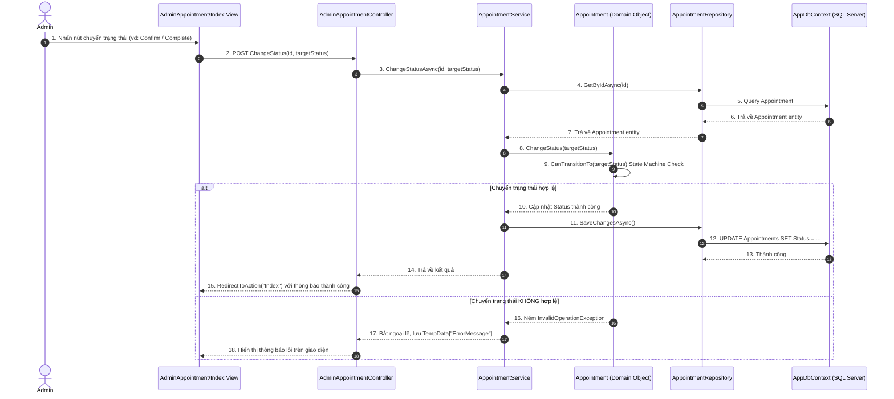

# Sơ đồ Tuần tự: Admin Cập Nhật Trạng Thái (Admin Status Update Sequence Diagram)

```mermaid
sequenceDiagram
    autonumber
    actor Admin
    participant View as AdminAppointment/Index View
    participant Ctrl as AdminAppointmentController
    participant Service as AppointmentService
    participant Entity as Appointment (Domain Object)
    participant Repo as AppointmentRepository
    participant DB as AppDbContext (SQL Server)

    Admin->>View: 1. Nhấn nút chuyển trạng thái (vd: Confirm / Complete)
    View->>Ctrl: 2. POST ChangeStatus(id, targetStatus)
    Ctrl->>Service: 3. ChangeStatusAsync(id, targetStatus)
    Service->>Repo: 4. GetByIdAsync(id)
    Repo->>DB: 5. Query Appointment
    DB-->>Repo: 6. Trả về Appointment entity
    Repo-->>Service: 7. Trả về Appointment entity
    
    Service->>Entity: 8. ChangeStatus(targetStatus)
    Entity->>Entity: 9. CanTransitionTo(targetStatus) State Machine Check
    alt Chuyển trạng thái hợp lệ
        Entity-->>Service: 10. Cập nhật Status thành công
        Service->>Repo: 11. SaveChangesAsync()
        Repo->>DB: 12. UPDATE Appointments SET Status = ...
        DB-->>Repo: 13. Thành công
        Service-->>Ctrl: 14. Trả về kết quả
        Ctrl-->>View: 15. RedirectToAction("Index") với thông báo thành công
    else Chuyển trạng thái KHÔNG hợp lệ
        Entity-->>Service: 16. Ném InvalidOperationException
        Service-->>Ctrl: 17. Bắt ngoại lệ, lưu TempData["ErrorMessage"]
        Ctrl-->>View: 18. Hiển thị thông báo lỗi trên giao diện
    end
```
