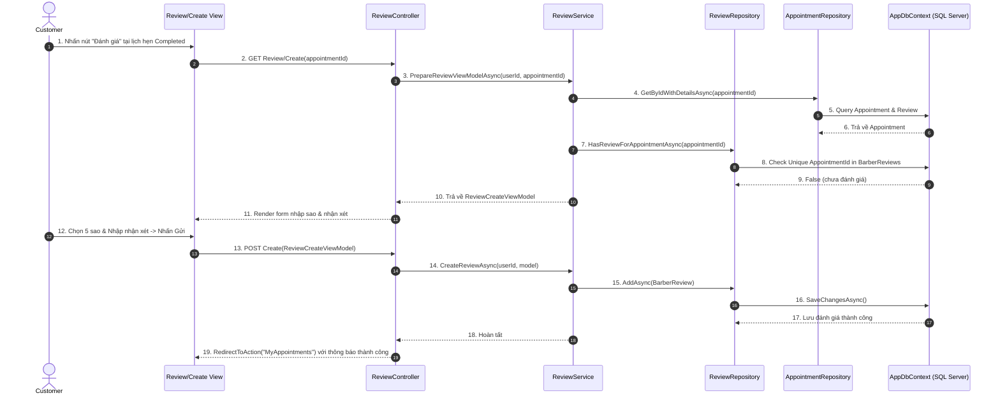

# Sơ đồ Tuần tự: Khách Hàng Đánh Giá Barber (Customer Review Sequence Diagram)

```mermaid
sequenceDiagram
    autonumber
    actor Customer
    participant View as Review/Create View
    participant Ctrl as ReviewController
    participant Service as ReviewService
    participant ReviewRepo as ReviewRepository
    participant ApptRepo as AppointmentRepository
    participant DB as AppDbContext (SQL Server)

    Customer->>View: 1. Nhấn nút "Đánh giá" tại lịch hẹn Completed
    View->>Ctrl: 2. GET Review/Create(appointmentId)
    Ctrl->>Service: 3. PrepareReviewViewModelAsync(userId, appointmentId)
    Service->>ApptRepo: 4. GetByIdWithDetailsAsync(appointmentId)
    ApptRepo->>DB: 5. Query Appointment & Review
    DB-->>ApptRepo: 6. Trả về Appointment
    Service->>ReviewRepo: 7. HasReviewForAppointmentAsync(appointmentId)
    ReviewRepo->>DB: 8. Check Unique AppointmentId in BarberReviews
    DB-->>ReviewRepo: 9. False (chưa đánh giá)
    Service-->>Ctrl: 10. Trả về ReviewCreateViewModel
    Ctrl-->>View: 11. Render form nhập sao & nhận xét

    Customer->>View: 12. Chọn 5 sao & Nhập nhận xét -> Nhấn Gửi
    View->>Ctrl: 13. POST Create(ReviewCreateViewModel)
    Ctrl->>Service: 14. CreateReviewAsync(userId, model)
    Service->>ReviewRepo: 15. AddAsync(BarberReview)
    ReviewRepo->>DB: 16. SaveChangesAsync()
    DB-->>ReviewRepo: 17. Lưu đánh giá thành công
    Service-->>Ctrl: 18. Hoàn tất
    Ctrl-->>View: 19. RedirectToAction("MyAppointments") với thông báo thành công
```
